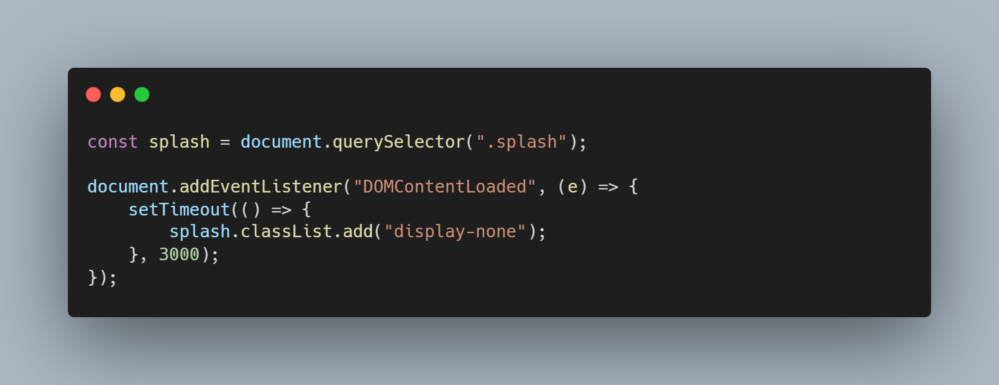

# splash-screen
Splash screen merupakan tampilan yang muncul saat pertama kali kita membuka sebuah aplikasi. Splash screen biasanya menampilkan logo, nama, dan lainnya yang berhubungan dengan aplikasi.

## HTML Script

## CSS Script

## JS Script

